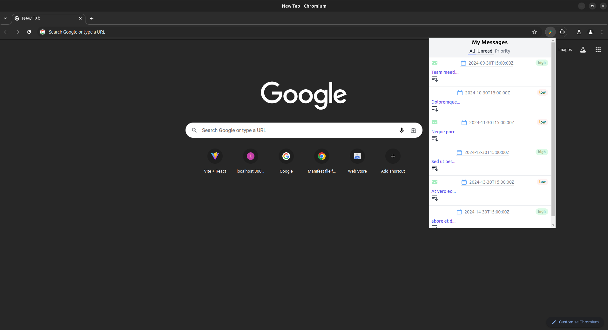

# React + Vite chrome extension

## Features
- Show a badge icon when there are unread messages
- Display messages in a popup when the extension icon is clicked
- Allow users to mark messages as read
- Store message history locally

### quick overview
If you've previously installed create-react-app globally via npm install -g create-react-app, we recommend you uninstall the package using npm uninstall -g create-react-app to ensure that npx always uses the latest version.

### set up the manifest.json file
- set default popup to index.html
- set permission for scripting and storage

## File Structure
message-extension
├── README.md
├── node_modules
├── package.json
├── .gitignore
├── public
│   ├── img
│   │   ├── icon-16.png
│   │   ├── icon-48.png
│   │   ├── icon-128.png
│   ├── popup.html
│   ├── options.html
│   └── manifest.json
└── src
    ├── background
    │   ├── index.js
    ├── contentScripts
    │   ├── index.js
    ├── options
    │   ├── index.js
    │   ├── Options.js
    ├── App.css
    ├── App.js
    ├── App.test.js
    ├── index.css
    ├── index.js
    ├── logo.svg

## screenshot

This template provides a minimal setup to get React working in Vite with HMR and some ESLint rules.

Currently, two official plugins are available:

- [@vitejs/plugin-react](https://github.com/vitejs/vite-plugin-react/blob/main/packages/plugin-react/README.md) uses [Babel](https://babeljs.io/) for Fast Refresh
- [@vitejs/plugin-react-swc](https://github.com/vitejs/vite-plugin-react-swc) uses [SWC](https://swc.rs/) for Fast Refresh
